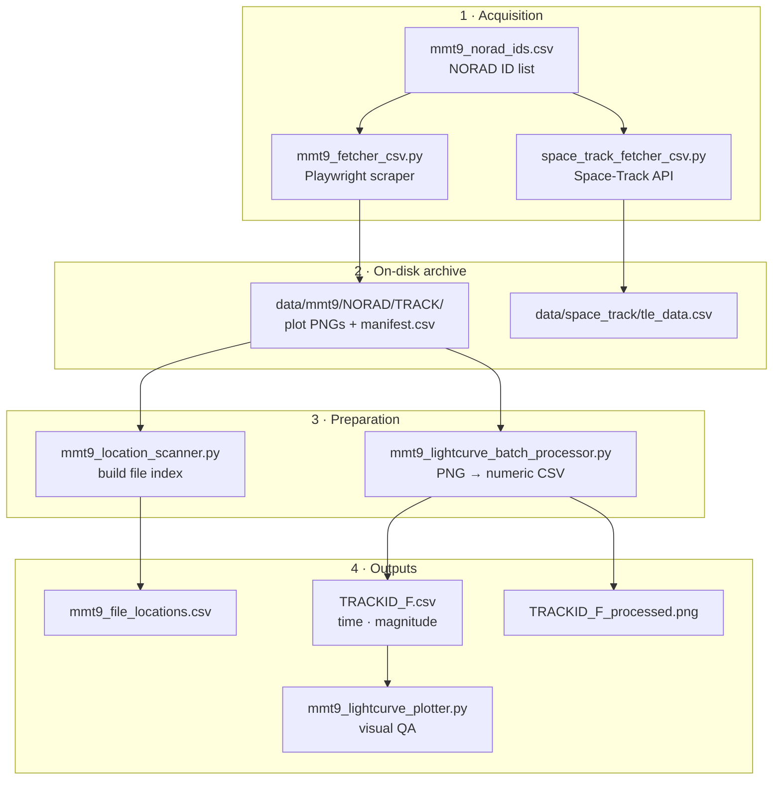

# AI-Enabled Space Situational Awareness — Data Acquisition Toolkit

**Light-curve and orbital-element collection for Resident Space Object (RSO) characterization**

| | |
|---|---|
| **Team** | Space Junkies |
| **Repository** | [github.com/mars-colonizer/Space-Debris-Characterization](https://github.com/mars-colonizer/Space-Debris-Characterization) |
| **Stack** | Python 3 · Playwright · Tkinter · pandas · NumPy · Pillow · Matplotlib · requests |
| **Interface** | Desktop GUI (Tkinter) — one window per tool |

---

## What This Project Does

This repository is the **data acquisition and preparation layer** for RSO characterization. It collects two independent observational modalities for a list of NORAD catalogue IDs, then converts the light-curve products into machine-readable numeric series:

1. **Photometric light curves** — scraped from the [MMT-9 / Mini-MegaTORTORA](http://mmt.favor2.info/satellites) public archive
2. **Orbital elements** — TLE / GP data pulled from the [Space-Track](https://www.space-track.org) API
3. **Digitized brightness series** — MMT-9 publishes light curves only as rendered PNG plots, so the plots are re-digitized back into `(time, magnitude)` CSVs

Every tool is a **standalone desktop application**. There is no shared framework, no package to install, and no import coupling between scripts — each one is run directly and does one job.



---

## Repository Layout

```
.
├── mmt9_fetcher_csv.py                  # MMT-9 batch scraper (GUI)
├── mmt9_test.py                         # MMT-9 single-object scraper (console)
├── mmt9_location_scanner.py             # Index downloaded plots into a CSV (GUI)
├── mmt9_lightcurve_batch_processor.py   # Digitize plot PNGs → numeric CSV (GUI)
├── mmt9_lightcurve_plotter.py           # Plot a digitized CSV (GUI)
├── mmt9_norad_ids.csv                   # 535 NORAD IDs — scraper input
├── mmt9_candidates.csv                  # 50 candidate objects + DISCOS metadata
│
├── Space-Track/
│   ├── space_track_fetcher_csv.py       # Space-Track TLE fetcher (GUI)
│   └── data/space_track/tle_data.csv    # 50 fetched TLE records
│
├── data/mmt9/                           # Downloaded archive (8 objects, 151 tracks)
│   └── <NORAD_ID>/
│       ├── manifest.csv
│       └── <TRACK_ID>/
│           ├── <TRACK_ID>_D.png … _S.png
│           ├── <TRACK_ID>_F.csv           (generated)
│           └── <TRACK_ID>_F_processed.png (generated)
│
└── trial/mmt9_fetcher_csv.py            # Byte-identical copy of the root fetcher
```

> **Note:** `trial/mmt9_fetcher_csv.py` is currently an exact duplicate (identical MD5) of the root `mmt9_fetcher_csv.py`. It is kept only as a scratch copy — edit the root script, not this one.

---

## The Tools

| Script | Interface | Input | Output |
|---|---|---|---|
| `mmt9_fetcher_csv.py` | GUI | CSV of NORAD IDs | `data/mmt9/<NORAD>/<TRACK>/*.png` + `manifest.csv` |
| `mmt9_test.py` | Console | Hard-coded `NORAD_ID` | Same layout, single object |
| `space_track_fetcher_csv.py` | GUI | CSV of NORAD IDs + credentials | `data/space_track/tle_data.csv` |
| `mmt9_location_scanner.py` | GUI | `data/mmt9/` folder | `mmt9_file_locations.csv` |
| `mmt9_lightcurve_batch_processor.py` | GUI | `data/mmt9/` folder | `*_F.csv`, `*_F_processed.png` |
| `mmt9_lightcurve_plotter.py` | GUI | One `*_F.csv` | On-screen Matplotlib plot |

---

## Quick Start

### 1. Clone and install

```bash
git clone git@github.com:mars-colonizer/Space-Debris-Characterization.git
cd Space-Debris-Characterization
python3 -m venv .venv
source .venv/bin/activate          # Windows: .venv\Scripts\activate
pip install playwright pandas numpy pillow matplotlib requests
```

### 2. Install the Playwright browser

The MMT-9 scrapers drive a real Chromium instance. This step is required and is separate from `pip install`:

```bash
playwright install chromium
```

### 3. Tkinter check

All GUI tools use Tkinter, which ships with most Python builds but is a separate package on some systems:

```bash
python3 -c "import tkinter; print('tkinter OK')"
```

If that fails: `brew install python-tk` (macOS) or `sudo apt install python3-tk` (Debian/Ubuntu).

---

## Workflow

### Step 1 — Fetch MMT-9 light curves

```bash
python3 mmt9_fetcher_csv.py
```

Select a CSV containing a `NORAD_ID` column (`mmt9_norad_ids.csv` works out of the box) and start the run. The scraper will:

- Open `http://mmt.favor2.info/satellites` in Chromium, retrying up to **5 times** with a 5-second delay — MMT-9 intermittently serves a blank page, so a successful HTTP response is not treated as a successful load
- Locate the catalogue-ID input, search each NORAD ID in turn, and parse the resulting track table
- Keep only **periodic tracks** (tracks with a measured rotation period)
- Download every available plot product per track
- Write `manifest.csv` per object with columns `norad_id, track_id, period_sec, downloaded_products`

The run is threaded and can be interrupted with the **Stop** button; the GUI log shows live progress.

The column name is matched case-insensitively and accepts `NORAD_ID`, `NORAD ID`, `NORADID`, `Catalogue ID`, or `catalogue_id`. Excel-style trailing `.0` on numeric IDs is stripped automatically.

For a single object without the GUI, edit `NORAD_ID` at the top of `mmt9_test.py` and run it — same logic, console output.

### Step 2 — Fetch TLEs from Space-Track

```bash
python3 Space-Track/space_track_fetcher_csv.py
```

Enter your Space-Track username and password (the password field is masked), select the same NORAD ID CSV, and run. The tool authenticates against `/ajaxauth/login`, queries the `gp` class per object, and appends to `data/space_track/tle_data.csv` with columns:

```
NORAD_ID, TLE_LINE_1, TLE_LINE_2
```

Requests are spaced **1 second apart** with a 60-second timeout to stay within Space-Track's rate limits.

> **Credentials:** entered at runtime into the GUI only. They are held in memory for the session and are never written to disk, logged, or committed. Do not hard-code them into the script.

### Step 3 — Index what was downloaded

```bash
python3 mmt9_location_scanner.py
```

Point it at `data/mmt9/`. It walks every `<NORAD_ID>/<TRACK_ID>/` folder and writes `mmt9_file_locations.csv`:

```
NORAD ID, TRACK ID, D, F, L, M, P, R
```

Each plot-type column holds the absolute path to that plot, or an empty string when the track is missing it — so incomplete downloads are visible rather than silently skipped. One row is emitted per track even when the folder is empty.

### Step 4 — Digitize the light curves

```bash
python3 mmt9_lightcurve_batch_processor.py
```

Point it at `data/mmt9/`. It searches recursively for `*_F.png` (folded light curves) and reconstructs the numeric series behind each plot.

For every input it writes, into the same track folder:

| File | Contents |
|---|---|
| `<TRACK_ID>_F.csv` | `pixel_x, time_seconds, magnitude, magnitude_smooth` |
| `<TRACK_ID>_F_processed.png` | Overlay of the reconstructed curve for visual QA |

### Step 5 — Inspect a result

```bash
python3 mmt9_lightcurve_plotter.py
```

Select any generated `*_F.csv`. It requires `time_seconds` and `magnitude` columns, coerces both to numeric, drops unparseable rows, and renders the curve.

---

## MMT-9 Plot Products

MMT-9 exposes several rendered products per track. The location scanner indexes six of them:

| Code | Product |
|---|---|
| `D` | Distance |
| `F` | Folded light curve |
| `L` | Raw light curve |
| `M` | PDM (phase dispersion minimization) plot |
| `P` | Lomb-Scargle periodogram |
| `R` | Raw light curve with standard magnitude |

The fetcher additionally downloads products labelled `S`, `I`, and `T` when present. These are stored but not indexed by the scanner.

**`F` is the only product the batch processor digitizes** — the pixel calibration is specific to the folded-light-curve plot layout.

---

## How Digitization Works

MMT-9 publishes light curves only as rendered images, so `mmt9_lightcurve_batch_processor.py` recovers the underlying data by reading the pixels.

**Fixed calibration.** The `F` plot layout is constant, so the plot area is hard-coded — x from pixel 56 to 865, y from 33 to 393 — with five known axis tick positions mapped to their axis values in each direction. Pixel coordinates are converted to seconds and magnitudes by interpolating against those ticks.

**Reconstruction stages:**

1. **Digitize** — read the RGB image, isolate curve pixels inside the plot area
2. **Representative curve** — collapse each pixel column to one value by taking the **median** of the pixels in that column, which rejects stray marks and anti-aliasing
3. **Interpolate gaps** — bridge breaks up to `MAX_INTERPOLATION_GAP = 3` columns wide; wider gaps are left as genuine gaps rather than invented data
4. **Smooth** — rolling window of `SMOOTH_WINDOW = 7` applied per continuous segment, so smoothing never bridges a real gap. Written as the separate `magnitude_smooth` column, leaving the raw `magnitude` values intact

Tuning constants sit at the top of the file (`RUN_STAGE`, `TARGET_PLOT_TYPE`, `MAX_INTERPOLATION_GAP`, `SMOOTH_WINDOW`).

> **Calibration caveat:** the pixel bounds and tick positions are specific to MMT-9's current `F` plot rendering. If the archive changes its plot styling or image dimensions, the calibration constants must be re-measured or every digitized value will be silently wrong. Always spot-check `*_F_processed.png` after a batch run.

---

## Data Files

### `mmt9_norad_ids.csv`
Single column `NORAD_ID` — 535 catalogue IDs. Default input for both fetchers.

### `mmt9_candidates.csv`
50 shortlisted objects with DISCOS-derived metadata: `candidate_number`, `norad_id`, `name`, `international_designator`, `type`, `length`, `diameter`, `span`, `shape`, `mass`, `country`, `manufacturer`, `mission`, `owner`, `launch_date`, `launch_mass`, `launch_site`, `launch_pad`, `lifetime`, `rcs`, `size_scale`, plus MMT-9 coverage columns `mmt9_found`, `mmt9_track_count`, `mmt9_period`, `mmt9_notes`.

### `Space-Track/data/space_track/tle_data.csv`
50 TLE records: `NORAD_ID`, `TLE_LINE_1`, `TLE_LINE_2`.

### `data/mmt9/`
Currently 8 NORAD objects across 151 tracks. This directory is committed to the repository (~116 MB of PNG and CSV files).

---

## Notes and Known Limitations

- **The archive is committed to git.** `data/mmt9/` adds ~116 MB to every clone and is permanent in history. If it grows further, consider moving it out of git — the fetcher can regenerate it from `mmt9_norad_ids.csv`.
- **Scraping is brittle by nature.** The MMT-9 tools depend on the live site's DOM structure. Element lookups are attribute-based rather than positional to reduce breakage, but a site redesign will still require updating the selectors in `find_catalogue_input()`, `find_track_table()`, and `extract_product_links()`.
- **GUI-only.** Every tool except `mmt9_test.py` requires a display. There is no headless or CLI mode, so these cannot currently run in CI or over a plain SSH session.
- **`mmt9_test.py` has its target hard-coded** at the top of the file rather than taking an argument.
- **Never commit `.env` or credentials.** `.gitignore` covers `.env`; rotate any credential that reaches a commit.
