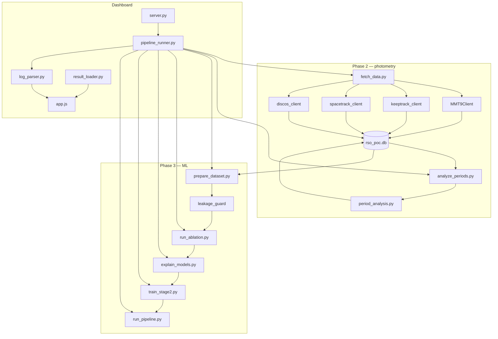
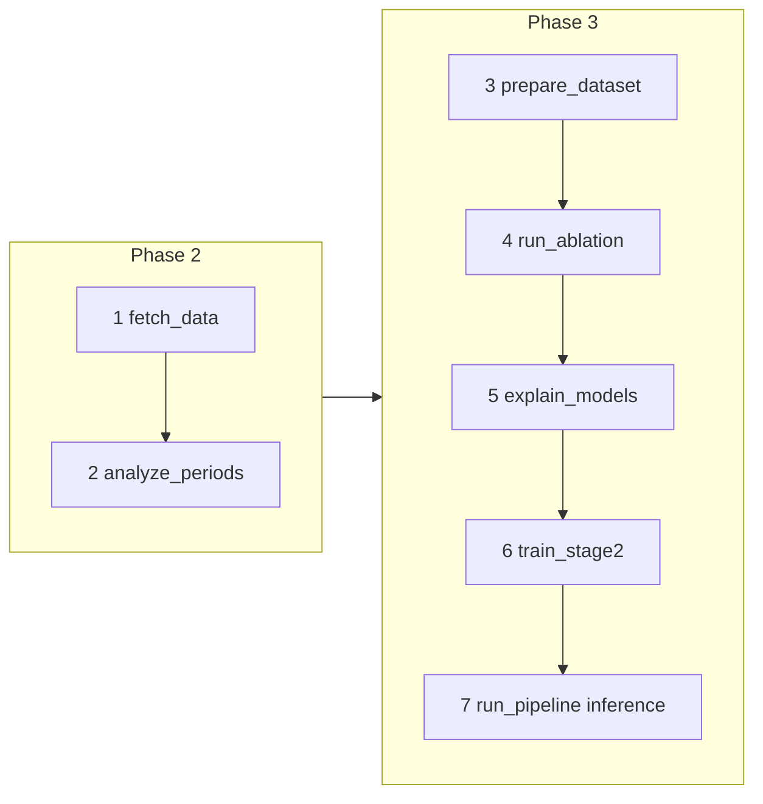
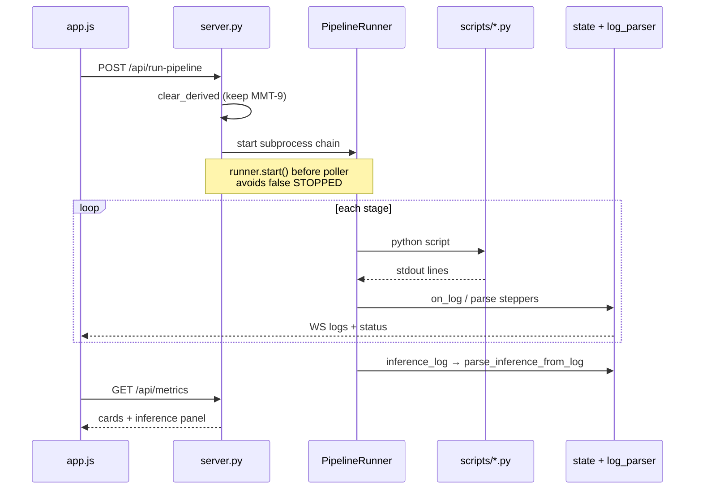

# Space Junkies — RSO Characterization Pipeline

**Space Junkies** ingests multi-source Resident Space Object (RSO) data, extracts rotation periods from MMT-9 photometry, then (Phase 3) classifies objects and estimates physical properties with small-N ML.

| | |
|---|---|
| **Phases** | 2 — Photometric PoC · 3 — Classification + mass regression + XAI |
| **Repository** | [github.com/mars-colonizer/Space-Debris-Characterization](https://github.com/mars-colonizer/Space-Debris-Characterization) |
| **Code map** | [graphify-out/graph.html](graphify-out/graph.html) · [GRAPH_REPORT.md](graphify-out/GRAPH_REPORT.md) |

CLI and dashboard call the **same scripts**. The dashboard’s **Run Full SSA Pipeline** button runs Phase 2 then Phase 3 end-to-end.

---

## What / why / when (one screen)

| Question | Answer |
|----------|--------|
| **What** | A PoC SSA stack: live or synthetic ingest → period analysis → feature matrix → Stage 1 class (Payload / Rocket Body / Debris) → Stage 2 mass → demo inference panel |
| **Why** | Photometry alone is weak for class/size; fusing orbital + photometric features under launch-group CV tests whether MMT-9 periods add signal without leaking DISCOS labels |
| **When** | Phase 2 whenever you need light curves / periods / PoC plots. Phase 3 after Phase 2 artifacts exist (or via full SSA run). Re-run ML after changing the candidate set or period pipeline |
| **How** | `scripts/*.py` orchestrate; `src/` holds clients, features, models; `dashboard/` subprocesses those scripts and parses logs into steppers + metric cards |

---

## Architecture (from Graphify)

Graphify extracts a **code knowledge graph** (~767 nodes · ~1872 edges · 41 communities). Use it to answer “what calls what” without reading every file.

**Core hubs (god nodes):** `MMT9Client`, `_write_actual_mmt_first()`, `init_database()`, `run_period_analysis()`, dashboard `server.py` / `PipelineRunner`, Phase 3 script `main()` entrypoints.

**Community map (how the repo is clustered):**



Refresh the graph after code changes (no LLM / API cost):

```bash
graphify update .
# optional: open interactive map
open graphify-out/graph.html
```

Useful queries:

```bash
graphify explain "MMT9Client"
graphify explain "apply_leakage_guard"
graphify path "prepare_dataset.py" "run_pipeline.py" --undirected
```

---

## End-to-end pipeline (when each stage runs)



| # | Script | What | Why | When |
|---|--------|------|-----|------|
| 1 | `scripts/fetch_data.py` | Pull/cache MMT-9, resolve NORAD→COSPAR, TLE, DISCOS → CSV + SQLite | Need a coherent object set before photometry/ML | First step of any live/synthetic ingest; dashboard **Ingestion** or full SSA |
| 2 | `scripts/analyze_periods.py` | Quality filter → Lomb–Scargle → PDM → fold + PoC PNGs | Rotation period / tumbling are photometric features for Stage 1 | After fetch; dashboard **Photometric Processing** |
| 3 | `scripts/prepare_dataset.py` | Merge TLE+DISCOS, orbital + photometric features, leakage guard, `phase3_feature_matrix.csv` | Build train-safe object-level matrix | After periods (needs photometry + catalog) |
| 4 | `scripts/run_ablation.py` | GroupKFold ablation: orbital vs photometric vs **fused** LightGBM | Prove fusion helps; save `models/stage1/lgbm_fused.pkl` | After prepare |
| 5 | `scripts/explain_models.py` | GroupKFold confusion matrix + optional SHAP | Explain fused model decisions | After ablation (`shap` optional) |
| 6 | `scripts/train_stage2.py` | Per-class RF mass regressors (LOOCV, min 5 samples) | Condition mass on predicted class | After explain (needs matrix + classes) |
| 7 | `scripts/run_pipeline.py` | Pick demo object → Stage 1 class → Stage 2 mass → print spin/tumbling | Dashboard **End-to-End Inference** panel | After Stage 2 models exist |

**Dashboard steppers (UI only, Phase 2):** MMT-9 → KeepTrack → TLE+DISCOS → quality → LSP/PDM → central DB → evaluation artifacts. Phase 3 stages are separate buttons / full SSA chain; they do **not** remount the Phase 2 “database” stepper on soft warnings.

**Before each new dashboard run:** derived outputs are cleared (models/processed/DB depending on stage set); **MMT-9 track cache is preserved**.

---

## Phase 2 — Photometric proof of concept

### What happens

1. **Ingest** multi-source data into `data/raw/` and `data/database/rso_poc.db`
2. **Process** each object’s light curve through quality → LSP → PDM → phase fold
3. **Emit** periodograms, folded curves, summary CSVs, PoC plots

### ACTUAL ingest order (`DATA_MODE=ACTUAL`)

When `data/raw/mmt9_candidates.csv` exists:

1. **MMT-9** — download or load cached photometry per candidate NORAD  
2. **KeepTrack** — NORAD → COSPAR (International Designator)  
3. **Space-Track** — GP/TLE history **only** for KeepTrack-resolved MMT objects  
4. **DISCOS** — metadata **only** for those same objects  
5. Persist light curves, object index, TLE, DISCOS → CSV + SQLite  

If KeepTrack is down: MMT curves still save; TLE/DISCOS are skipped.

### MMT-9 light-curve handling

- All tracks per object are **merged** (not longest-only)
- Each track is **median-detrended** before concat (pass-to-pass offset)
- Sorted by time; deduped on `(object_id, time)`
- Names from MMT-9 catalog (`object_name` in DB)

### Period analysis (`src/features/period_analysis.py`)

| Step | How | Why |
|------|-----|-----|
| Quality filter | Drop non-finite / bad mags; need ≥10 points and ≥60 s span | Garbage in → false periods |
| Lomb–Scargle | Astropy `LombScargle` + Baluev FAP on a span-aware frequency grid | Uneven sampling; FAP gates “periodic” |
| PDM | Refine / validate around LSP peak (±15%) | Second opinion before folding |
| Phase fold + plots | Fold at selected period; PNG: raw / periodogram / folded (mag inverted) | Human PoC artifacts |

Tumbling: no stable significant period (FAP / consistency rules in the analyzer).

---

## Phase 3 — Characterization ML

### Dataset preparation (`prepare_dataset.py`)

**What:** Builds `data/processed/phase3_feature_matrix.csv` — one row per object.

**How:**

1. Load / clean TLE + DISCOS; merge on normalized COSPAR  
2. Engineer **orbital** features (`compute_orbital_features`)  
3. Aggregate **photometric** features from period analysis / tracks (`PHOTOMETRIC_FEATURE_COLS`)  
4. Collapse DISCOS subclasses → `Payload` | `Rocket Body` | `Debris`  
5. Add `launch_group` for GroupKFold (same launch must not leak train→test)  
6. **`apply_leakage_guard`** — strip ground-truth size/mass/class columns from `X`; keep photometric observables  

**Why leakage guard matters:** DISCOS `mass` / `length` / `object_class` are labels or near-labels. Training on them would fake perfect accuracy. Photometric columns like `median_period_sec` are allowed — they are measurements, not catalog answers.

### Stage 1 ablation (`run_ablation.py`)

| Feature set | Contents | Purpose |
|-------------|----------|---------|
| Orbital | inclination, eccentricity, SMA, rates, epoch span, … | Baseline without photometry |
| Photometric | track_count, periodic_fraction, median_period_sec, period_scatter, median_amplitude, is_tumbling_consistent | Photometry-only |
| **Fused** | orbital ∪ photometric | Target model for ops |

- CV: **GroupKFold** on `launch_group` (default 4 splits)  
- Models: LightGBM (+ AdaBoost/tree baselines in the script)  
- Artifact: `models/stage1/lgbm_fused.pkl` (model + label encoder + feature names + fill value)

### Explainability (`explain_models.py`)

- Out-of-fold confusion matrix for the fused LightGBM  
- SHAP feature importance if `shap` is installed (optional — CM still runs without it)  
- Writes under `results/phase3/` (dashboard Phase 3 image gallery)

### Stage 2 regression (`train_stage2.py`)

- **What:** Prefer continuous target `mass` (else `true_mass`, …)  
- **How:** One `RandomForestRegressor` per class with ≥5 labeled samples; **LOOCV** metrics (small-N honest)  
- **Why class-conditioned:** Mass distributions differ sharply by class; a single global regressor mixes regimes  
- **Artifacts:** `models/stage2/regressor_payload.pkl`, `regressor_rocket_body.pkl` (Debris often skipped — too few mass labels)

### End-to-end inference (`run_pipeline.py`)

1. Load fused Stage 1 model + feature matrix  
2. Prefer a **Payload / Rocket Body** sample that has a trained mass regressor (dashboard-friendly demo)  
3. Predict class + confidence  
4. Run matching Stage 2 regressor → **Estimated mass**  
5. Print **spin period** / **tumbling** from photometric columns (not Stage 2)  
6. Dashboard parses stdout (`Mass: … kg`, `Spin period: … s`, …) into the inference card  

There is no L×W×H model in the default Phase 3 path; the UI shows mass when dimensions are absent.

---

## Data modes

| Mode | Credentials | Behaviour |
|------|-------------|-----------|
| **`SYNTHETIC`** | None | Physics-informed offline objects (TLE-like, DISCOS-like, synthetic curves) |
| **`ACTUAL`** | Space-Track, DISCOS, KeepTrack (recommended) | Live ingest for NORADs in `mmt9_candidates.csv` |

Set in `.env` (`DATA_MODE=…`) or toggle in the dashboard before a run. Mode is copied into the subprocess environment when the dashboard starts a pipeline.

---

## Technology

| Layer | Stack |
|-------|--------|
| Pipeline | Python 3 · pandas · NumPy · SciPy · Astropy · matplotlib · LightGBM · scikit-learn |
| Storage | CSV under `data/` + SQLite (`data/database/rso_poc.db`) |
| Dashboard | FastAPI · uvicorn · vanilla HTML/JS · Tailwind (CDN) · WebSocket logs |
| Graph | `graphify` CLI → `graphify-out/` (code knowledge graph) |
| External | [MMT-9](http://mmt.favor2.info) · [KeepTrack](https://api.keeptrack.space/v4/docs) · [Space-Track](https://www.space-track.org/) · [ESA DISCOS](https://discosweb.esoc.esa.int/) |

No Streamlit, React, or Node build step.

---

## Quick start

### 1. Install

```bash
cd "/path/to/V2"
python3 -m venv .venv
source .venv/bin/activate
pip install -r requirements.txt
cp .env.example .env
```

### 2. Configure `.env`

**Offline:**

```env
DATA_MODE=SYNTHETIC
```

**Live:**

```env
DATA_MODE=ACTUAL
SPACE_TRACK_USERNAME=your@email.com
SPACE_TRACK_PASSWORD=your_password
DISCOS_TOKEN=your_discos_token
KEEPTRACK_API_KEY=your_keeptrack_api_key
MMT9_CANDIDATES_CSV=data/raw/mmt9_candidates.csv
FETCH_EPOCH_DAYS=60
```

Never commit `.env`. KeepTrack data is [CC BY-NC 4.0](https://creativecommons.org/licenses/by-nc/4.0/).

### 3. CLI — Phase 2 only

```bash
export PYTHONPATH=.
python3 scripts/fetch_data.py
python3 scripts/analyze_periods.py
```

Tips:

- First ACTUAL MMT download: ~1–2 min/object (50 candidates ≈ 30–60+ min)  
- Cache hits skip re-download  
- Subset: `MMT9_CANDIDATES_LIMIT=5 python3 scripts/fetch_data.py`  
- Force refresh: `MMT9_FORCE_REFRESH=1 python3 scripts/fetch_data.py`

### 4. CLI — Phase 3

```bash
export PYTHONPATH=.
python3 scripts/prepare_dataset.py
python3 scripts/run_ablation.py
python3 scripts/explain_models.py      # pip install shap  # optional
python3 scripts/train_stage2.py
python3 scripts/run_pipeline.py        # end-to-end demo object
```

### 5. Dashboard

```bash
source .venv/bin/activate
PYTHONPATH=. python3 -m uvicorn dashboard.server:app --host 127.0.0.1 --port 8555 --reload
```

Open [http://127.0.0.1:8555](http://127.0.0.1:8555).

| Control | Runs |
|---------|------|
| **Run Full SSA Pipeline** | fetch → periods → prepare → ablation → explain → stage2 → inference |
| Ingestion / Photometric Processing | Phase 2 pieces |
| Prepare / Stage 1 / XAI / Stage 2 / Inference | Phase 3 pieces |
| Stop | Kill subprocess |
| Reset / Clear All Data | Purge derived artifacts (see API) |

Pipeline Python: process interpreter, or **`RSO_PYTHON`** if set (TrueNAS).

---

## TrueNAS / network share

Do **not** create `.venv` on the SMB/NFS project folder — execute bits are blocked.

```bash
mkdir -p /dev/shm/venvs
python3 -m venv /dev/shm/venvs/rso-v2 --without-pip
curl -sS https://bootstrap.pypa.io/get-pip.py -o /tmp/get-pip.py
/dev/shm/venvs/rso-v2/bin/python3 /tmp/get-pip.py
/dev/shm/venvs/rso-v2/bin/python3 -m pip install -r "/mnt/SC/Sanu/Study Project/V2/requirements.txt"

export RSO_PYTHON=/dev/shm/venvs/rso-v2/bin/python3
cd "/mnt/SC/Sanu/Study Project/V2"
PYTHONPATH=. $RSO_PYTHON -m uvicorn dashboard.server:app --host 127.0.0.1 --port 8555
```

SSH tunnel from your Mac:

```bash
ssh -L 8555:127.0.0.1:8555 truenas_admin@10.10.10.101
```

Then open **http://127.0.0.1:8555**. `/dev/shm/venvs` clears on reboot. Prefer `python3 -m pip` / `python3 -m uvicorn` over bare `bin/pip` scripts.

---

## MMT candidate list

**File:** `data/raw/mmt9_candidates.csv` — must include a NORAD column (`norad_id`, `norad`, `satno`, or `object_id`):

```csv
candidate_number,norad_id,name
1,28897,NCUBE-2
2,43656,CZ-4B R/B
```

### MMT cache layout

| Path | Purpose |
|------|---------|
| `data/raw/mmt_lightcurves/mmt_lightcurves.csv` | Combined light curves |
| `data/raw/mmt_lightcurves/mmt9_tracks/{norad}_{track_id}.txt` | Per-track raw cache |
| `data/raw/mmt_lightcurves/mmt9_catalog.txt` | Catalog (~7 day TTL) |

---

## Dashboard internals (how the UI stays honest)



| Module | Role |
|--------|------|
| `dashboard/stages.py` | Exec stage keys, scripts, Phase 2 vs 3, `FULL_PIPELINE_KEYS` |
| `dashboard/pipeline_runner.py` | Subprocess chain, log broadcast, `inference_log` capture |
| `dashboard/log_parser.py` | Map log lines → stepper COMPLETE/WARNING/FAILED; sanitize secrets |
| `dashboard/result_loader.py` | Metrics from DB/CSV/artifacts; parse inference stdout |
| `dashboard/state.py` | Run lifecycle + `inference_result` |
| `dashboard/static/app.js` | Steppers, Phase 3 cards, inference (mass / spin / tumbling) |

### Selected API

| Method | Endpoint | Purpose |
|--------|----------|---------|
| `GET` | `/` | UI |
| `GET/POST` | `/api/current-mode`, `/api/set-mode` | SYNTHETIC / ACTUAL |
| `GET` | `/api/metrics` | Metric cards + inference |
| `POST` | `/api/run-pipeline` | Full SSA (Phase 2+3) |
| `POST` | `/api/run-stage/{name}` | One exec stage |
| `POST` | `/api/stop-pipeline` | Stop |
| `POST` | `/api/reset-all` | Purge artifacts |
| `WS` | `/ws/logs` | Live logs + status |

---

## Project layout

```
├── dashboard/              # FastAPI UI, runner, parsers, result_loader
├── data/
│   ├── raw/                # TLE, DISCOS, MMT cache, candidates CSV
│   ├── processed/          # photometric CSVs, phase3_feature_matrix.csv
│   └── database/           # rso_poc.db
├── models/
│   ├── stage1/             # lgbm_fused.pkl
│   └── stage2/             # regressor_{class}.pkl
├── results/
│   ├── periodograms/       # norad_*.json
│   ├── folded_lightcurves/
│   ├── poc_plots/          # norad_*.png
│   ├── phase3/             # confusion matrix, SHAP
│   └── pipeline_runs/      # dashboard run logs
├── scripts/                # CLI entrypoints (see table above)
├── src/
│   ├── config.py           # paths, columns, leakage lists
│   ├── data/               # API clients, SQLite, merge, leakage_guard
│   ├── features/           # quality, period_analysis, orbital, photometric
│   ├── models/             # stage1/stage2 helpers, RSOPipeline (legacy path)
│   └── utils/terminal.py   # shared CLI logging (dashboard parses these lines)
├── graphify-out/           # code knowledge graph + report
└── tests/
```

---

## Database tables

| Table | Contents |
|-------|----------|
| `objects` | `object_id` (NORAD), `cospar_id`, `object_name` |
| `light_curves` | `time`, `mag`, `mag_err` |
| `photometric_observations` | Per-object period / quality summary |
| `periodograms` | LSP/PDM + JSON paths |
| `folded_light_curves` | Phase-folded samples |
| `rso_catalog` | Ground-truth labels (SYNTHETIC) |

> **Credentials:** entered at runtime into the GUI only. They are held in memory for the session and are never written to disk, logged, or committed. Do not hard-code them into the script.

## Configuration reference

| Variable | Default | Description |
|----------|---------|-------------|
| `DATA_MODE` | `SYNTHETIC` | `SYNTHETIC` or `ACTUAL` |
| `RSO_PYTHON` | — | Dashboard subprocess interpreter (TrueNAS) |
| `MMT9_CANDIDATES_CSV` | `data/raw/mmt9_candidates.csv` | ACTUAL NORAD list |
| `MMT9_CANDIDATES_LIMIT` | `0` | Subset cap (`0` = all) |
| `MMT9_FORCE_REFRESH` | `false` | Ignore MMT cache |
| `FETCH_EPOCH_DAYS` | `60` | Space-Track GP lookback |
| `FETCH_MAX_OBJECTS` | `50` | Catalog fallback if CSV missing |
| `KEEPTRACK_API_KEY` | — | NORAD ↔ COSPAR |

See `.env.example` for the full list.

---

## Troubleshooting

| Problem | Fix |
|---------|-----|
| `No module named 'pandas'` from dashboard | Set `RSO_PYTHON` to the venv with `requirements.txt` |
| `failed to map segment from shared object` | Venv off the network share → `/dev/shm/venvs/...` |
| Browser can't reach NAS `:8555` | Bind localhost + SSH tunnel, or `--host 0.0.0.0` |
| Scripts can't import `src` | `PYTHONPATH=.` from project root |
| Empty MMT objects | NORAD missing from MMT catalog — check ingest warnings |
| No TLE/DISCOS for some objects | Expected without KeepTrack COSPAR |
| Inference shows empty mass / spin | Re-run **Inference** after Stage 2; hard-refresh UI. Debris often has no mass regressor — panel shows n/a + spin from photometry |
| SHAP missing | Optional: `pip install shap`; confusion matrix still works |
| False STOPPED right after Start | Fixed by starting runner before poller — update `dashboard/server.py` if on an old checkout |
| Graphify stale | `graphify update .` then open `graphify-out/graph.html` |

---

## Limitations

- Fixed candidate set; not every NORAD has MMT tracks or KeepTrack COSPAR  
- KeepTrack individual lookup capped (~25/run) — some COSPARs may be missing  
- SQLite + CSV — PoC scale, not production ops  
- Stage 2 mass needs ≥5 labeled samples/class — Debris often skipped  
- Small-N GroupKFold/LOOCV: metrics are indicative, not flight certification  

---

## Exploring the code with Graphify

This repo is mapped with **graphify** so architecture stays queryable as scripts grow.

| Artifact | Use |
|----------|-----|
| [`graphify-out/graph.html`](graphify-out/graph.html) | Interactive community graph |
| [`graphify-out/GRAPH_REPORT.md`](graphify-out/GRAPH_REPORT.md) | Hubs, communities, surprising edges, suggested questions |
| [`graphify-out/graph.json`](graphify-out/graph.json) | Machine-readable graph |

```bash
graphify update .                 # re-extract after edits
graphify explain "fetch_data.py"  # neighbors of a hub
graphify explain "PipelineRunner" # or path::symbol if ambiguous
graphify path "MMT9Client" "apply_leakage_guard" --undirected
```

**Suggested questions the graph is good at answering** (from the report):

- Why does `MMT9Client` bridge fetch, legacy `MMTClient`, and `_write_actual_mmt_first`?  
- What does `apply_leakage_guard` remove vs allow before Stage 1?  
- How do dashboard `ExecStage` / `StepDef` relate to log-parser stepper keys?

---

## License & attribution

Academic / competition PoC.

**Data sources:** [Space-Track](https://www.space-track.org/) · [ESA DISCOS](https://discosweb.esoc.esa.int/) · [MMT-9 / Mini-MegaTORTORA](http://mmt9.ru/satellites/) ([mmt.favor2.info](http://mmt.favor2.info)) · [KeepTrack](https://keeptrack.space/)
