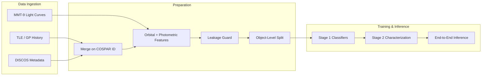

# AI-Enabled Space Situational Awareness

**Explainable classification and multi-modal characterization of Resident Space Objects (RSOs)**

| | |
|---|---|
| **Team** | Space Junkies |
| **Phase** | 2 — Design & Proof of Concept |
| **Repository** | [github.com/mars-colonizer/Space-Debris-Characterization](https://github.com/mars-colonizer/Space-Debris-Characterization) |
| **Stack** | Python 3 · scikit-learn · LightGBM · SciPy · FastAPI · SQLite |

---

## What This Project Does

This is a **proof-of-concept pipeline** for Space Situational Awareness (SSA). It takes multi-modal observations about orbiting objects and predicts:

1. **What kind of object it is** (rocket body, defunct satellite, fragment, etc.)
2. **How big it is** (length, width, height in metres)
3. **What shape it likely has** (Cylinder, Box-Wing, Flat-Plate, Irregular)
4. **How it is rotating** (spin period in seconds; stable vs tumbling)

The pipeline deliberately separates **observational inputs** (TLE orbital history, light-curve statistics) from **ground-truth labels** (catalog dimensions, true shape, true spin) so that models are trained without data leakage.



---

## Dual Data Mode: SYNTHETIC vs ACTUAL

All ingestion flows through **`scripts/fetch_data.py`**, controlled by `DATA_MODE` in `.env` or the dashboard toggle.

| Mode | When to use | What happens |
|------|-------------|--------------|
| **`SYNTHETIC`** | Offline demos, CI, no credentials | Generates ~80 physics-informed objects via `src/data/api_connectors.py` — TLE epochs, DISCOS metadata, catalog truths, and light-curve summaries. Fully self-contained. |
| **`ACTUAL`** | Real experiments | Fetches live **Space-Track** TLEs and **ESA DISCOS** metadata, then pulls **MMT-9 / Mini-MegaTORTORA** light curves via API with offline CSV fallback. Requires credentials. |

```bash
# .env
DATA_MODE=SYNTHETIC    # or ACTUAL
```

Both modes write the **same file layout** under `data/raw/`, so downstream scripts (`prepare_dataset.py`, training, inference) need **no code changes** when you switch modes.

> **Legacy note:** `USE_SYNTHETIC=true/false` in `.env` still works as a fallback when `DATA_MODE` is unset. Prefer `DATA_MODE` going forward.

---

## Quick Start

### 1. Clone and install

```bash
git clone git@github.com:mars-colonizer/Space-Debris-Characterization.git
cd Space-Debris-Characterization
python -m venv .venv
source .venv/bin/activate          # Windows: .venv\Scripts\activate
pip install -r requirements.txt
cp .env.example .env
```

### 2. Ingest data

**Synthetic (recommended first run — no API keys):**

```bash
# .env: DATA_MODE=SYNTHETIC
python scripts/fetch_data.py
```

**Live APIs:**

```bash
# .env: DATA_MODE=ACTUAL
# Set SPACE_TRACK_USERNAME, SPACE_TRACK_PASSWORD, DISCOS_TOKEN
python scripts/fetch_data.py
```

For MMT light curves in ACTUAL mode, either configure `MMT_API_URL` or place offline CSV files in `data/raw/mmt_lightcurves/` (see [Offline MMT files](#offline-mmt-light-curve-files) below).

> **Security:** Never commit `.env`. Rotate credentials if exposed.

`scripts/generate_sample_data.py` is a thin wrapper that still works, but **`fetch_data.py` is the canonical ingestion entry point**.

### 3. Train and infer (CLI)

```bash
python scripts/prepare_dataset.py   # merge, features, leakage filter, train/test split
python scripts/train_stage1.py      # Decision Tree, LightGBM, AdaBoost
python scripts/train_stage2.py      # size, shape, rotation models (per class)
python scripts/run_pipeline.py      # end-to-end inference on one test object
```

### 4. Control dashboard (optional)

```bash
uvicorn dashboard.server:app --host 127.0.0.1 --port 8000 --reload
```

Open [http://127.0.0.1:8000](http://127.0.0.1:8000)

Use the **header mode switch** (🧪 Synthetic / 📡 Live) to pick the data source, then click **Run Full Pipeline**. The dashboard runs the same `scripts/` — no duplicated ML logic.

---

## Control Dashboard

FastAPI backend + single-page HTML/JS frontend (TailwindCSS via CDN, no Node build step).

### UI features

| Feature | Description |
|---------|-------------|
| **Mode switch** | Toggle `SYNTHETIC` ↔ `ACTUAL` before ingestion; logged to the live terminal |
| **Pipeline control** | Full pipeline or individual stages (Ingestion → Prepare → Stage 1 → Stage 2 → Inference) |
| **Live terminal** | WebSocket log stream with `[INFO]` / `[OK]` / `[WARNING]` / `[ERROR]`; API tokens redacted |
| **10-step stepper** | Real-time status per pipeline phase |
| **Metric cards** | Ingestion, photometry, data quality, leakage, Stage 1/2, inference (shape + spin) |
| **Run history** | `results/pipeline_runs/<timestamp>/` with per-run and bulk delete |
| **Reset** | Purge processed data, models, and metrics (`POST /api/reset-all`) |

### API reference

| Method | Endpoint | Purpose |
|--------|----------|---------|
| `GET` | `/` | Dashboard UI |
| `GET` | `/api/current-mode` | Active `SYNTHETIC` or `ACTUAL` |
| `POST` | `/api/set-mode` | Set mode: `{"mode": "SYNTHETIC" \| "ACTUAL"}` |
| `GET` | `/api/status` | Pipeline state, stepper, timers |
| `GET` | `/api/metrics` | Metric cards from disk artifacts |
| `GET` | `/api/previous-runs` | Run history |
| `POST` | `/api/run-pipeline` | Full sequential pipeline (uses active mode for fetch) |
| `POST` | `/api/run-stage/{name}` | Single stage: `fetch`, `prepare`, `stage1`, `stage2`, `inference` |
| `POST` | `/api/stop-pipeline` | Terminate active subprocess |
| `POST` | `/api/reset-all` | Clear data/models/metrics (blocked while RUNNING) |
| `DELETE` | `/api/runs/{run_id}` | Delete one historical run |
| `DELETE` | `/api/runs` | Clear all run history |
| `WS` | `/ws/logs` | Live log + status stream |

Mode cannot be changed while a pipeline run is active.

---

## Project Structure

```
Space-Debris-Characterization/
├── dashboard/                    # FastAPI control center
│   ├── server.py                 # REST + WebSocket routes
│   ├── pipeline_runner.py        # Subprocess orchestration + log broadcast
│   ├── state.py                  # Thread-safe pipeline state
│   ├── stages.py                 # UI steps ↔ script mappings
│   ├── log_parser.py             # Step status + credential masking
│   ├── result_loader.py          # Metric card data from disk
│   ├── templates/index.html
│   └── static/                   # app.js, terminal.css
│
├── data/
│   ├── raw/                      # Regenerable source CSVs (gitignored)
│   │   ├── tle_history.csv
│   │   ├── discos_metadata.csv
│   │   ├── photometric_observations.csv
│   │   ├── rso_catalog.csv
│   │   └── mmt_lightcurves/      # Offline MMT CSV/JSON fallback
│   ├── processed/                # train.csv, test.csv, dataset_meta.json
│   └── database/                 # SQLite (rso_poc.db)
│
├── models/                       # Saved joblib models (gitignored)
├── results/                      # Metrics, confusion matrices, run logs
│
├── scripts/                      # CLI entry points (orchestration only)
│   ├── fetch_data.py             # ★ Unified ingestion (SYNTHETIC or ACTUAL)
│   ├── generate_sample_data.py   # Legacy wrapper → synthetic generator
│   ├── prepare_dataset.py
│   ├── train_stage1.py
│   ├── train_stage2.py
│   └── run_pipeline.py
│
└── src/
    ├── config.py                 # Paths, seeds, leakage rules, column names
    ├── data/
    │   ├── data_mode.py          # Runtime SYNTHETIC/ACTUAL resolution
    │   ├── api_connectors.py     # Synthetic multi-modal catalog generator
    │   ├── mmt_client.py         # MMT-9 client + photometric feature extraction
    │   ├── db_manager.py         # SQLite: rso_catalog, photometric_observations
    │   ├── leakage_guard.py      # Blocks ground truth from feature matrix X
    │   ├── spacetrack_client.py
    │   ├── discos_client.py
    │   ├── merge_data.py, clean_data.py, ingest.py, storage.py
    ├── features/orbital_features.py
    ├── models/                   # Stage 1/2 + sequential RSOPipeline
    └── evaluation/               # Metrics helpers
```

**Design rule:** ML logic lives in `src/` and `scripts/`. The dashboard only **orchestrates** existing scripts as subprocesses.

---

## Data Sources & Files

| Source | Raw file | Role |
|--------|----------|------|
| Space-Track GP/TLE | `data/raw/tle_history.csv` | Orbital element time series per object |
| ESA DISCOS | `data/raw/discos_metadata.csv` | Object class, physical metadata |
| MMT / photometry | `data/raw/photometric_observations.csv` | Per-object light-curve **summary features** |
| Ground-truth catalog | `data/raw/rso_catalog.csv` | True dimensions, shape, spin (training labels only) |

Everything merges on **COSPAR ID** (`YYYY-NNN[A-Z]`), normalized in `src/data/clean_data.py`. A merge audit is written to `data/processed/merge_summary.txt`.

---

## MMT-9 Light-Curve Processing

Implemented in `src/data/mmt_client.py`.

### What the client does

1. **Live API** — attempts `MMT_API_URL` (configurable in `.env`) for `(timestamps, magnitudes, errors)` given a COSPAR or NORAD ID.
2. **Offline fallback** — if the API times out or fails, reads CSV/JSON from `data/raw/mmt_lightcurves/`.
3. **Feature extraction** — `extract_photometric_features()` compresses each light curve into the six summary columns used by the ML pipeline.

### Extracted features (model inputs — allowed in X)

| Column | How it is computed |
|--------|-------------------|
| `mag_mean` | Mean apparent magnitude |
| `mag_std` | Standard deviation of magnitudes |
| `delta_mag` | 95th − 5th percentile (peak-to-peak amplitude) |
| `estimated_period_sec` | Dominant period from **Lomb–Scargle** periodogram (clamped 1–3600 s) |
| `apparent_shape_score` | Skewness of the magnitude distribution |
| `is_tumbling` | `1` if no dominant rotation period is detected; `0` if a stable periodic signal dominates |

### Offline MMT light-curve files

Place files in `data/raw/mmt_lightcurves/` when the live API is unavailable:

**Per-object CSV** (`{norad_id}_{cospar}.csv`):

```csv
timestamp,magnitude,error
2024-01-01T00:00:00Z,10.20,0.05
2024-01-01T00:00:15Z,10.85,0.05
```

**Combined CSV** (`mmt_lightcurves.csv`):

```csv
cospar_id,object_id,timestamp,magnitude,error
1998-067A,OBJ-0042,2024-01-01T00:00:00Z,10.2,0.05
```

See `data/raw/mmt_lightcurves/README.md` for full format notes.

---

## Synthetic Light-Curve Profiles

When `DATA_MODE=SYNTHETIC`, `src/data/api_connectors.py` generates class-conditioned light curves:

| Object class | True shape | Spin period | Δm | Tumbling |
|--------------|------------|-------------|-----|----------|
| Rocket Body | Cylinder | 5–30 s | 1.5–3.0 | Mostly stable |
| Defunct Satellite / MRO | Box-Wing | 60–600 s | 0.2–0.8 | Stabilized (`0`) |
| Fragment | Irregular / Flat-Plate | 0.5–8 s | > 2.0 | Chaotic (`1`) |

Catalog truths and photometric summaries are also persisted to SQLite (`src/data/db_manager.py`).

---

## Leakage Prevention

Physical properties must **not** appear in the feature matrix during training — otherwise models would cheat by reading the answer.

`src/data/leakage_guard.py` removes ground-truth columns before training:

| Blocked from X (labels) | Allowed in X (observations) |
|-------------------------|----------------------------|
| `true_length`, `true_width`, `true_height` | `mag_mean`, `mag_std`, `delta_mag` |
| `true_mass`, `true_shape`, `true_period` | `estimated_period_sec`, `apparent_shape_score` |
| `true_tumbling`, `object_class` | `is_tumbling` (observational estimate) |
| Legacy: `length`, `width`, `height`, `mass`, `shape` | Orbital features (inclination, SMA, drift, …) |

The dashboard **Leakage Protection** card lists removed columns and verifies zero COSPAR overlap between train and test splits.

---

## Feature Engineering & Split

**Orbital** (`src/features/orbital_features.py`) — aggregated to one row per object:

- Keplerian snapshot: inclination, eccentricity, semi-major axis, RAAN, arg perigee, mean anomaly
- Derived: `orbital_period_days`, inclination drift, SMA decay, epoch count/span

**Photometric** — merged at prepare time from `photometric_observations.csv`.

**Preprocessing:** `SimpleImputer` + `OneHotEncoder` inside sklearn `Pipeline`; fitted on **training data only**.

**Split:** Object-level holdout by COSPAR ID (`TEST_SIZE=0.2`, `RANDOM_SEED=42`). All epochs for one object stay in the same fold — prevents epoch leakage.

---

## Models & Outputs

### Stage 1 — Classification

| Model | Saved artifact |
|-------|----------------|
| Decision Tree | `models/stage1_decision_tree.joblib` |
| LightGBM | `models/stage1_lightgbm.joblib` *(default at inference)* |
| AdaBoost | `models/stage1_adaboost.joblib` |

**Classes:** Rocket Body, Defunct Satellite, Mission-Related Object, Fragment.

Metrics → `results/stage1_metrics.csv` + confusion matrix PNGs.

### Stage 2 — Class-conditioned characterization

One model set **per object class** (skipped if fewer than 5 training samples):

| Model type | Predicts | Artifact |
|------------|----------|----------|
| Size regressor | `true_length`, `true_width`, `true_height` | `models/stage2/{class}.joblib` |
| Shape classifier | `true_shape` (4 geometric classes) | `models/stage2_shape_models.joblib` |
| Rotation | `true_period`, tumbling state | `models/stage2_rotation_models.joblib` |

Metrics → `results/stage2_metrics.csv`.

### End-to-end inference example

```
Predicted class: Rocket Body
Confidence: 100.00%
Length: 9.80 m  ·  Width: 3.40 m  ·  Height: 2.75 m
Shape: Cylinder
Spin period: 13.75 s  ·  Tumbling: Stable
Latency: 0.024 s
```

Stage 1 routes to the correct Stage 2 model bundle. If Stage 1 misclassifies, Stage 2 uses the wrong class model — a realistic operational error mode.

---

## Configuration Reference

### Environment variables (`.env`)

| Variable | Default | Description |
|----------|---------|-------------|
| `DATA_MODE` | `SYNTHETIC` | `SYNTHETIC` or `ACTUAL` — primary mode switch |
| `USE_SYNTHETIC` | `true` | Legacy fallback when `DATA_MODE` unset |
| `SPACE_TRACK_USERNAME` | — | Space-Track login (ACTUAL mode) |
| `SPACE_TRACK_PASSWORD` | — | Space-Track password (ACTUAL mode) |
| `DISCOS_TOKEN` | — | ESA DISCOSweb bearer token (ACTUAL mode) |
| `MMT_API_URL` | built-in default | MMT light-curve API endpoint (optional) |
| `FETCH_MAX_OBJECTS` | `200` | DISCOS fetch limit (ACTUAL mode) |
| `FETCH_EPOCH_DAYS` | `60` | TLE history window in days (ACTUAL mode) |

### Python constants (`src/config.py`)

| Constant | Default | Purpose |
|----------|---------|---------|
| `RANDOM_SEED` | `42` | Reproducibility |
| `TEST_SIZE` | `0.2` | Holdout fraction |
| `MIN_STAGE2_SAMPLES_PER_CLASS` | `5` | Minimum samples to train Stage 2 |
| `PHOTOMETRIC_FEATURE_COLS` | 6 columns | Allowed light-curve inputs |
| `LEAKAGE_TARGET_COLUMNS` | 7 `true_*` cols | Explicit ground-truth blocklist |

---

## Typical Workflows

### Offline demo (no credentials)

```bash
DATA_MODE=SYNTHETIC python scripts/fetch_data.py
python scripts/prepare_dataset.py
python scripts/train_stage1.py
python scripts/train_stage2.py
python scripts/run_pipeline.py
```

### Live experiment

```bash
# .env: DATA_MODE=ACTUAL + credentials
python scripts/fetch_data.py          # Space-Track + DISCOS + MMT
python scripts/prepare_dataset.py
python scripts/train_stage1.py
python scripts/train_stage2.py
python scripts/run_pipeline.py
```

### Dashboard-driven full run

```bash
uvicorn dashboard.server:app --host 127.0.0.1 --port 8000 --reload
# 1. Select mode in header
# 2. Click "Run Full Phase 2 Pipeline"
# 3. Watch live terminal + metric cards update
```

### Reset and start fresh

Use the dashboard **Reset / Clear All Data** button, or:

```bash
# Purges data/raw CSVs, processed sets, models, results metrics
# (via dashboard API POST /api/reset-all — or delete directories manually)
```

---

## Git Workflow

Remote (SSH recommended):

```bash
git remote -v
# origin  git@github.com:mars-colonizer/Space-Debris-Characterization.git

git add -A
git status
git commit -m "Describe your change"
git push origin main
```

---

## Limitations (POC Scope)

| Topic | Notes |
|-------|-------|
| Synthetic scores | Near-perfect Stage 1 on synthetic data is expected — orbital priors are class-separable by design |
| Stage 2 R² | May be negative on small holdouts without hyperparameter tuning |
| Shape/tumbling models | May fall back to constant predictions when a class has only one label in training |
| MMT API | Live endpoint is best-effort; offline CSV fallback is the primary ACTUAL-mode path until a production API URL is configured |
| SQLite storage | Partial — tables populated on ingest/prepare, not a full operational database |
| Explainability | SHAP / XAI deferred to Phase 3 |

| Capability | Status |
|------------|--------|
| Dual mode SYNTHETIC / ACTUAL | ✅ |
| Space-Track + DISCOS ingestion | ✅ |
| MMT light-curve features | ✅ |
| Multi-output Stage 2 (size + shape + rotation) | ✅ |
| FastAPI dashboard + mode toggle | ✅ |
| SHAP / hyperparameter tuning | Phase 3 |

---

## Phase 3 Boundary (Not Implemented)

- SHAP explainability and ablation studies
- Deep learning benchmarks
- Production deployment and latency SLA hardening
- Full operational DISCOS + MMT streaming ingestion

---

## License & Attribution

Phase 2 proof-of-concept for academic / competition use.

**Data sources:** [Space-Track](https://www.space-track.org/) · [ESA DISCOS](https://discosweb.esoc.esa.int/) · MMT-9 / Mini-MegaTORTORA (light-curve photometry)
